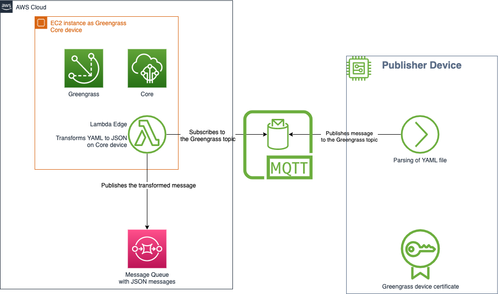

# aws-iot-greengrass-project

It is a simple application built with AWS SAM that contains the Lambda function to be built and deployed to an AWS IoT Greengrass Core device.
The function consumes String messages from device with content of a YAML file, transforms it to JSON directly on the Core device and sends to a SQS queue.
The architecture is described in the picture given below.



Please see the detailed explanation of the application in the [Medium blog post for Greengrass version 1](https://medium.com/@rostyslav.myronenko/aws-edge-computing-example-with-lambda-and-iot-greengrass-version-1-6bb710249d9a) and [Medium blog post for Greengrass version 2](https://medium.com/@rostyslav.myronenko/aws-edge-computing-example-with-lambda-and-iot-greengrass-version-2-aa68f2cc246).

## Prerequisites
- Java 1.8+
- Apache Maven
- [AWS SAM CLI](https://docs.aws.amazon.com/serverless-application-model/latest/developerguide/serverless-sam-cli-install.html)
- Docker

## Project structure
- [greengrassV1/ec2-greengrass-core-setup.sh](scripts/greengrassV1/ec2-greengrass-core-setup.sh) - The User Data script for AWS EC2 instance to install the Greengrass Software and configure the instance as the Greengrass Core device (Greengrass version 1).
- [greengrassV1/ec2-greengrass-device-setup.sh](scripts/greengrassV1/ec2-greengrass-device-setup.sh) - The User Data script for AWS EC2 instance to configure it as a Greengrass device and install the Greengrass V1 Python SDK to run Python scripts that can interact with Greengrass version 1.
- [greengrassV1/sendMessage.py](scripts/greengrassV1/sendMessage.py) - Python3 script to publish a test message from the device to the Core device via MQTT using SDK version 1.
- [greengrassV1/sendMessage.sh](scripts/greengrassV1/sendMessage.sh) - Bash script to trigger the Python script and send the message using SDK version 1 instead of inputting into the CLI.
- [greengrassV2/ec2-greengrass-core-device-setup.sh](scripts/greengrassV2/ec2-greengrass-core-device-setup.sh) - The User Data script for AWS EC2 instance to install the Greengrass Software, configure the instance as the Greengrass Core device (Greengrass version 2) and install the Greengrass V2 Python SDK to run Python scripts that can interact with Greengrass version 2.
- [greengrassV2/sendMessage.py](scripts/greengrassV2/sendMessage.py) - Python3 script to publish a test message from the device to the Core device via MQTT using SDK version 2.
- [greengrassV2/sendMessage.sh](scripts/greengrassV2/sendMessage.sh) - Bash script to trigger the Python script and send the message using SDK version 2 instead of inputting into the CLI.
- [template.yaml](template.yaml) - AWS SAM template.
- [SubscribeFunction.java](src/main/java/com/home/amazon/iot/lamnda/SubscribeFunction.java) - The Lambda function for the edge computing on the Core device.

## Development

The generated function handler class just returns the input. The configured AWS Java SDK client is created in `DependencyFactory` class, and you can 
add the code to interact with the SDK client based on your use case.

#### Building the project
```
sam build
```

#### Testing it locally
```
sam local invoke
```

#### Adding more SDK clients
To add more service clients, you need to add the specific services modules in `pom.xml` and create the clients in `DependencyFactory` following the same 
pattern as sqsClient.

## Deployment

The generated project contains a default [SAM template](https://docs.aws.amazon.com/serverless-application-model/latest/developerguide/sam-resource-function.html) file `template.yaml` where you can 
configure different properties of your lambda function such as memory size and timeout. You might also need to add specific policies to the lambda function
so that it can access other AWS resources.

To deploy the application, you can run the following command:

```
sam deploy --guided
```

See [Deploying Serverless Applications](https://docs.aws.amazon.com/serverless-application-model/latest/developerguide/serverless-deploying.html) for more info.


